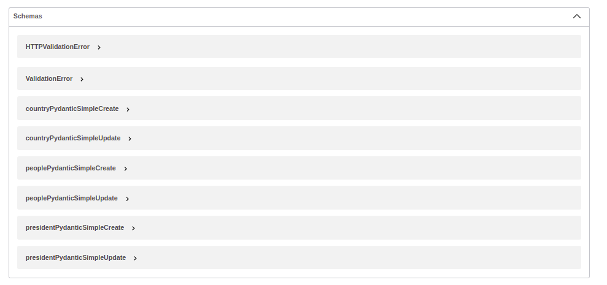
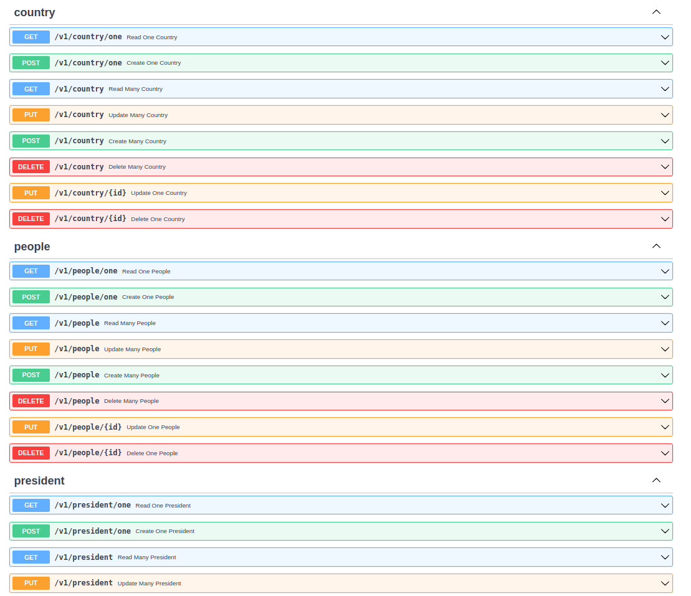

# FastAPI Simple CRUD Generator
[](https://pepy.tech/project/fastapi-simple-crud)

## Repository
- [ ] [GITHUB](https://github.com/Danangjoyoo/fastapi-simple-crud)

## Installation
```
pip install fastapi-simple-crud
```

## Description
A package to generate CRUD routers and endpoints in a very simple way. Based on SQLAlchemy asynchronous operation and schema.

## Changelogs
- v0.0
    - First Upload
- v0.1:
    - Added `ExtendedRouter`
    - Bugs fix

## How to use ?
```
from fastapi import FastAPI
from sqlalchemy import Column, ForeignKey, Integer, String
from sqlalchemy.orm import sessionmaker, relationship
from sqlalchemy.ext.declarative import declarative_base
from sqlalchemy.ext.asyncio import AsyncSession, create_async_engine

from fastapi_simple_crud import RouterMap

engine = create_async_engine("sqlite+aiosqlite:///./test.db", echo=True, future=True)
async_session = sessionmaker(engine, class_=AsyncSession, expire_on_commit=False)
Base = declarative_base()

async def get_session() -> AsyncSession:
    async with async_session() as session:
        yield session

class Country(Base):
    __tablename__ = "country"
    id = Column(Integer, primary_key=True, index=True, autoincrement=True)
    name = Column(String(100), nullable=False)

class President(Base):
    __tablename__ = "president"
    id = Column(Integer, primary_key=True, index=True)
    name = Column(String, nullable=False)
    country_id = Column(Integer, ForeignKey("country.id"))
    country = relationship("Country")

class People(Base):
    __tablename__ = "people"
    id = Column(Integer, primary_key=True, index=True)
    name = Column(String, nullable=False)
    age = Column(Integer)
    country_id = Column(Integer, ForeignKey("country.id"))
    country = relationship("Country")

app = FastAPI()

@app.on_event("startup")
async def startup():
    async with engine.begin() as conn:
        await conn.run_sync(Base.metadata.create_all)


## ULTRA SIMPLE OH MY GOD!

MyMap = RouterMap.create_router_map_from_base(base=Base)

RouterMap.generate(app, get_session)
```

## Results
- your endpoints
    - 
- your pydantic schema
    - 

## Example 1b : Too few for you? Relax. We have the Extended Version
simply set the `extend` parameter to `True` then you got the fully extended version
```
## ULTRA SIMPLE OH MY GOD!

RouterMap.create_router_map_from_base(Base, base_prefix="/v1", extend=True)

RouterMap.generate(app, get_session)
```
- your extended endpoints
    - 


## Example 2a : With `RouterMap`
```
from fastapi_simple_crud import SimpleCRUDGenerator, RouterMap, SimpleRouter, SimpleEndpoint

## ULTRA SIMPLE OH MY GOD!

class MyPresidentPydantic(BaseModel):
    name: int

class MyMap(RouterMap):
    country = SimpleRouter(Country, prefix="/v1/country")
    president = SimpleRouter(President, prefix="/v1/president",
        crud_update=None,
        crud_create=SimpleEndpoint(pydantic_model=MyPresidentPydantic),
        crud_read=SimpleEndpoint("/custom_read"))

RouterMap.generate(app, get_session)
```
- This example shows how to use `RouterMap` as a superclass
- You could disable the API generation by simply passing between these keyword arguments to `None` in the `SimpleRouter` definition:
  - `crud_create`
  - `crud_read`
  - `crud_update`
  - `crud_delete`
  - `disable_simple_crud` (will forcely disable all API generation)
- Only your defined router mapping inside you router map (in above example is `MyMap` class) will be generated. From the example, `People` router is not exist.
- `SimpleEndpoint()` refers to your HTTP method definition (GET/POST/PUT/DELETE) in the API decorator (ex: `@router.get()`, etc.)

## Example 2b : With `RouterMap` Extended Router
```
from fastapi_simple_crud import SimpleCRUDGenerator, RouterMap, ExtendedRouter, SimpleEndpoint

## ULTRA SIMPLE OH MY GOD!

class MyPresidentPydantic(BaseModel):
    name: int

class MyMap(RouterMap):
    country = ExtendedRouter(Country, prefix="/v1/country")
    president = ExtendedRouter(President, prefix="/v1/president",
        read_one=None,
        read_many=SimpleEndpoint("/custom_read")),
        update_one=SimpleEndpoint(pydantic_model=MyPresidentPydantic)

RouterMap.generate(app, get_session)
```
- You could disable the API generation by simply passing between these keyword arguments to `None` in the `ExtendedRouter` definition:
  - `create_one`
  - `create_many`
  - `read_one`
  - `read_many`
  - `update_one`
  - `update_many`
  - `delete_one`
  - `delete_many`
  - `disable_extended_crud` (will forcely disable all API generation)

## Example 3 : Add Your Custom Endpoints
```
from fastapi import Depends
from sqlalchemy import select
from fastapi_simple_crud import SimpleCRUDGenerator, RouterMap, SimpleRouter, SimpleEndpoint

## ULTRA SIMPLE OH MY GOD!

class MyPresidentPydantic(BaseModel):
    name: int

class MyMap(RouterMap):
    country = SimpleRouter(Country, prefix="/v1/country", crud_read=None)
    president = SimpleRouter(President, prefix="/v1/president")

@MyMap.country.get("/custom_read")
async def get_country(id: int, session: AsyncSession = Depends(get_session)):
    query = select(Country).where(Country.id==id)
    data = await session.execute(query)
    data = data.scalars().first()
    return data

RouterMap.generate(app, get_session)
```
- You could use your router from the your router map as shown above

## Example 4a : Router Modification - Disabling Some Routers
```
from fastapi_simple_crud import SimpleCRUDGenerator, RouterMap, SimpleRouter, SimpleEndpoint

## ULTRA SIMPLE OH MY GOD!

MyMap = RouterMap.create_router_map_from_base(base=Base)

## you want to remove people from autogeneration

class NewMap(MyMap):
    people = SimpleRouter(People, disable_simple_crud=True)

RouterMap.generate(app, get_session)
```
or inherit from the `RouterMap`
```
class NewMap(RouterMap):
    people = SimpleRouter(People, disable_simple_crud=True)
```
or simply update from the `RouterMap`
```
people = SimpleRouter(People, disable_simple_crud=True)
RouterMap.update_map(people)
```
or from the `MyMap`
```
MyMap.update_map(people)
```

## Example 4b : Router Modification - Change Router Type
You can override `ExtendedRouter` with `SimpleRouter` and vice versa.
```
class NewMap(RouterMap):
    people = SimpleRouter(People)

class NewMap2(RouterMap):
    people = Extended(People)
```

## Example 4c : Router Modification - Add your custom endpoints from `RouterMap.create_router_map_from_base()`
```
from fastapi import Depends
from sqlalchemy import select
from fastapi_simple_crud import SimpleCRUDGenerator, RouterMap, SimpleRouter, SimpleEndpoint

## ULTRA SIMPLE OH MY GOD!

MyMap = RouterMap.create_router_map_from_base(base=Base)

## use your tablename to get the router attribute from the created router map
## RouterMap in default will automatically mapped your router with its tablename

@MyMap.country.get("/custom_read")
async def get_country(id: int, session: AsyncSession = Depends(get_session)):
    query = select(Country).where(Country.id==id)
    data = await session.execute(query)
    data = data.scalars().first()
    return data

RouterMap.generate(app, get_session)
```
- Use your tablename to get the router attribute from the created router map (in above is `MyMap`)
- `RouterMap` in default will automatically mapped your router with its tablename (in above `Country` tablename is `country`)