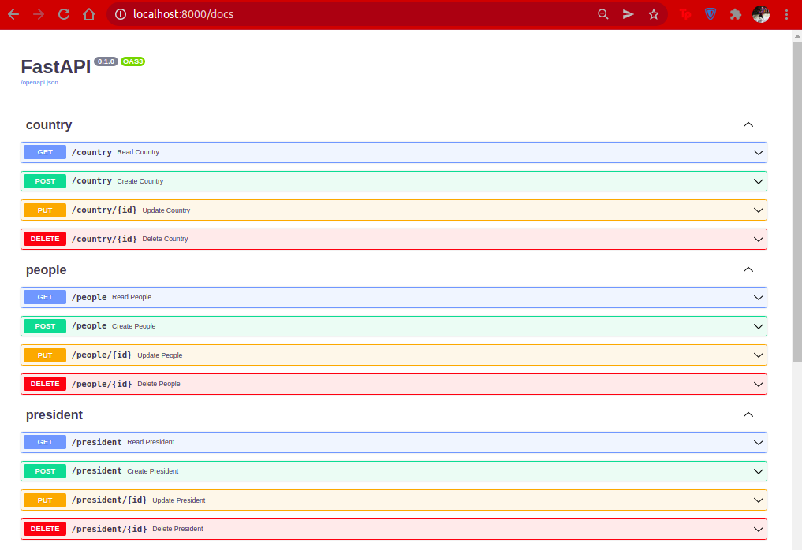

# FastAPI Simple CRUD Generator

## Repository
- [ ] [GITHUB](https://github.com/Danangjoyoo/fastapi-simple-crud)

## Installation
```
pip install fastapi-simple-crud
```

## Description
A package to generate a CRUD routers and endpoints in a very simple way. Based on SQLAlchemy asynchronous operation and schema.

## How to use ?
```
from dotenv import load_dotenv
load_dotenv()

from fastapi import FastAPI
from typing import Optional
from sqlalchemy import Column, ForeignKey, Integer, String
from sqlalchemy.orm import relationship
from sqlalchemy.ext.declarative import declarative_base
from sqlalchemy.ext.asyncio import AsyncSession, create_async_engine
from sqlalchemy.orm import sessionmaker

from .dependencies.simpleCRUD import SimpleCRUDGenerator, RouterMap

engine = create_async_engine("sqlite+aiosqlite:///./test.db", echo=True, future=True)
async_session = sessionmaker(engine, class_=AsyncSession, expire_on_commit=False)
Base = declarative_base()

async def get_session() -> AsyncSession:
    async with async_session() as session:
        yield session

class Country(Base):
    __tablename__ = "country"
    id = Column(Integer, primary_key=True, index=True, autoincrement=True)
    name = Column(String(100), nullable=False)

class President(Base):
    __tablename__ = "president"
    id = Column(Integer, primary_key=True, index=True)
    name = Column(String, nullable=False)
    country_id = Column(Integer, ForeignKey("country.id"))
    country = relationship("Country")

class People(Base):
    __tablename__ = "people"
    id = Column(Integer, primary_key=True, index=True)
    name = Column(String, nullable=False)
    age = Column(Integer)
    country_id = Column(Integer, ForeignKey("country.id"))
    country = relationship("Country")

app = FastAPI()

@app.on_event("startup")
async def startup():
    async with engine.begin() as conn:
        await conn.run_sync(Base.metadata.create_all)


## ULTRA SIMPLE OH MY GOD!

RouterMap.create_router_map_from_base(base=Base)

crudGenerator = SimpleCRUDGenerator(application=app, session_getter=get_session)
```

## Results
- your endpoints
    - 
- your pydantic schema
    - 